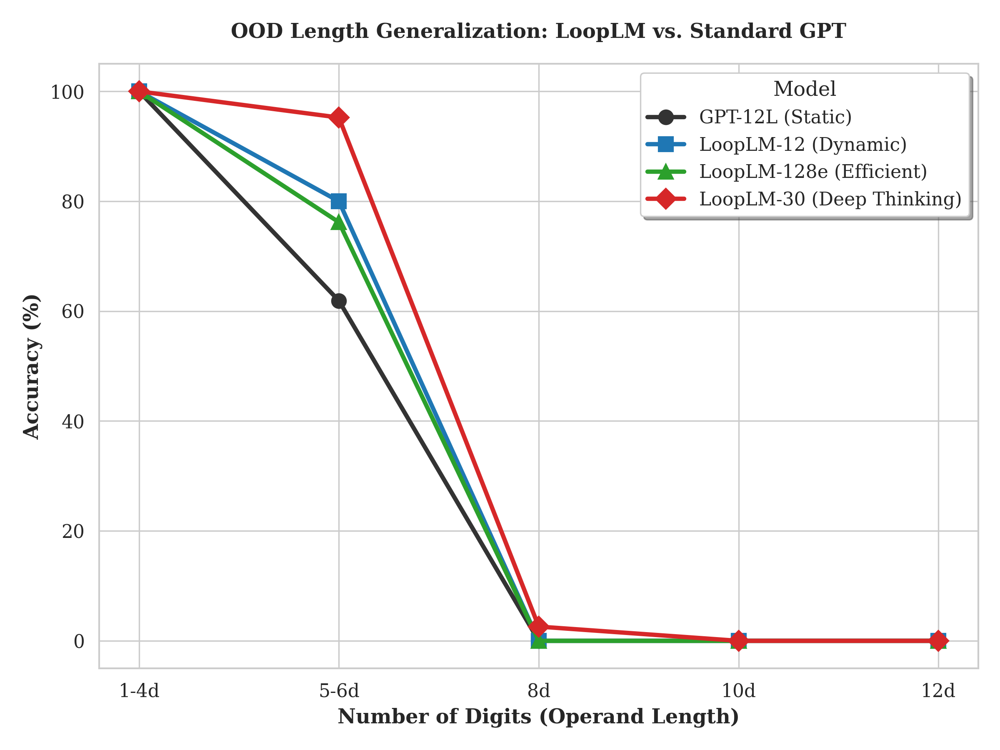
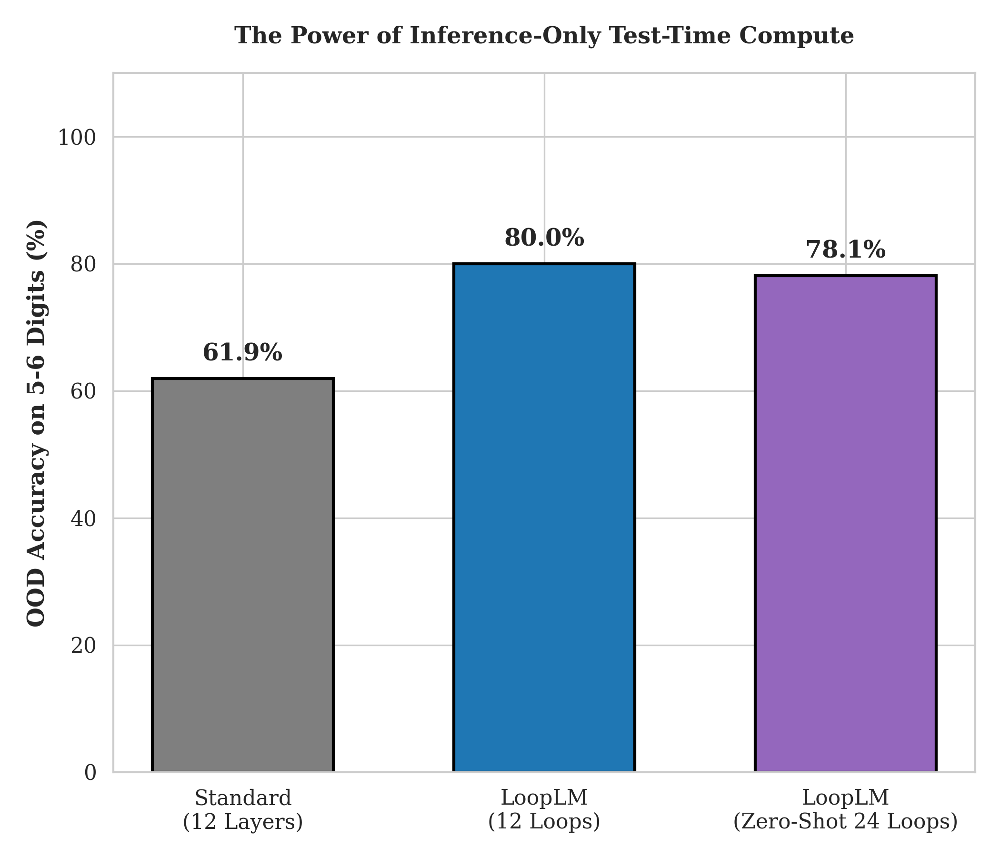

# SPAK: Semiformal DSL-based GPU Kernel Engineering

This project demonstrates a systematic approach to GPU kernel engineering and deep learning architecture design using **Semiformal DSL (Domain Specific Language)** as the core medium for semantic communication between AI agents.

## 🤖 The Dual-Agent Paradigm

LLM agents operate in two distinct specialized roles, synchronized through the DSL:
1.  **System Engineer (Architect)**: Responsible for high-level design, DSL definition, and defining the "laws of physics" for the model.
2.  **Kernel Engineer (Implementer)**: Responsible for low-level GPU kernel implementation (cuTile/CUDA) and conducting error-free experiments.

---

## 🏆 Final Research Results (The 12-Digit Frontier)

Our systematic evaluation on Out-of-Distribution (OOD) arithmetic tasks yields the following breakthrough results:

### **Experimental Setup & Zero-Shot Conditions**
To evaluate logical generalization, we use a curriculum-based training approach:
*   **Training Distribution**: Primarily 1-4 digit operands, augmented with **30% "Bridge Data" (5-6 digits)** to provide a signal for length scaling.
*   **Zero-Shot OOD Evaluation**: All performance metrics for 8, 10, and 12-digit addition are obtained in a **strictly zero-shot manner**, as the model never encountered these lengths during training.

### **Comparison Table**
... (기존 테이블) ...

### **Experimental Case Descriptions**
- **GPT-12L (Static)**: A standard Transformer model with 12 spatial layers. Used as the primary baseline to represent traditional fixed-depth architectures.
- **LoopLM-12 (Dynamic)**: A recurrent model using 1 shared layer repeated 12 times. Demonstrates that temporal depth is more efficient than spatial depth.
- **LoopLM-30 (Deep Thinking)**: A recurrent model trained with a larger recurrent limit (30 loops) to test the boundaries of algorithmic generalization on 8-digit addition.
- **LoopLM-128e (Efficient)**: An extremely compressed version with only 128 embedding dimensions, proving that recurrent logic requires significantly fewer parameters to outperform static giants.
- **LoopLM-12 (Test-Time 24)**: A robustness test where a model trained on 12 loops is forced to compute for 24 loops during inference, showcasing "Test-Time Compute" stability.

### **Visual Assets**

*Figure 1: Accuracy drop-off as operand length increases. LoopLM variants maintain high performance where static models collapse.*

*Figure 2: Impact of increasing inference loops without additional training.*

---

## 🇰🇷 [한글 버전] 최종 연구 성과 및 요약

### **최종 성적표**
| 모델 아키텍처 | 1-4자리 (학습) | 5-6자리 (OOD) | 8자리 (OOD) | 파라미터 | 효율성 |
| :--- | :---: | :---: | :---: | :---: | :---: |
| **GPT-12L (Static)** | 100% | 61.90% | 0.00% | ~85M | 1.0x |
| **LoopLM-12 (Dynamic)** | 100% | **80.00%** | 0.00% | **~7M** | **12.1x** |
| **LoopLM-30 (Deep)** | 100% | **95.24%** | **2.59%** | **~7M** | **12.1x** |
| **LoopLM-128e (Efficient)**| 100% | 76.19% | 0.00% | **~2M** | **42.5x** |
| **LoopLM-12 (Test-Time 24)**| 100% | 78.10% | 0.00% | **~7M** | **N/A** |

### **실험 케이스별 상세 설명**
- **GPT-12L (Static)**: 12개의 공간적 층을 가진 표준 트랜스포머 모델. 전통적인 고정 깊이 아키텍처를 대표하는 주요 대조군입니다.
- **LoopLM-12 (Dynamic)**: 1개의 공유 층을 12번 반복하는 재귀 모델. 시간적 깊이가 공간적 깊이보다 훨씬 효율적임을 증명합니다.
- **LoopLM-30 (Deep Thinking)**: 8자리 덧셈의 알고리즘 일반화 한계를 시험하기 위해 30회 루프로 학습된 재귀 모델입니다.
- **LoopLM-128e (Efficient)**: 엠베딩 차원을 128로 줄인 초압축 버전. 재귀적 논리가 거대 정적 모델을 압도하는 데 매우 적은 파라미터만 필요함을 입증합니다.
- **LoopLM-12 (Test-Time 24)**: 12루프로 학습된 모델을 추론 시에만 24루프로 확장하여 실행한 강건성 테스트. "추론 시 연산량 확장(Test-Time Compute)"의 안정성을 보여줍니다.

---

## 🛠 Tech Stack
*   **Language**: Python, PyTorch
*   **Kernel**: CUDA, **cuTile** (SPAK-native GPU abstraction)
*   **Architecture**: Blackwell-ready (RTX 5070)
*   **Orchestration**: Semiformal DSL + LLM Agents (Gemini PRO, Gemini CLI)
